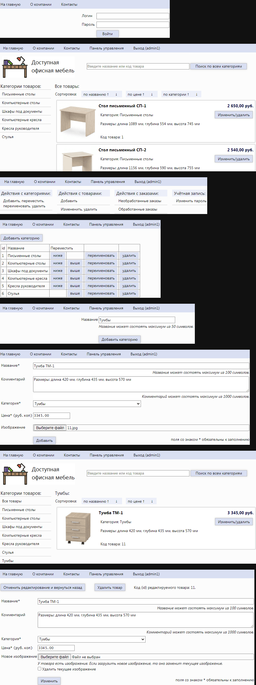
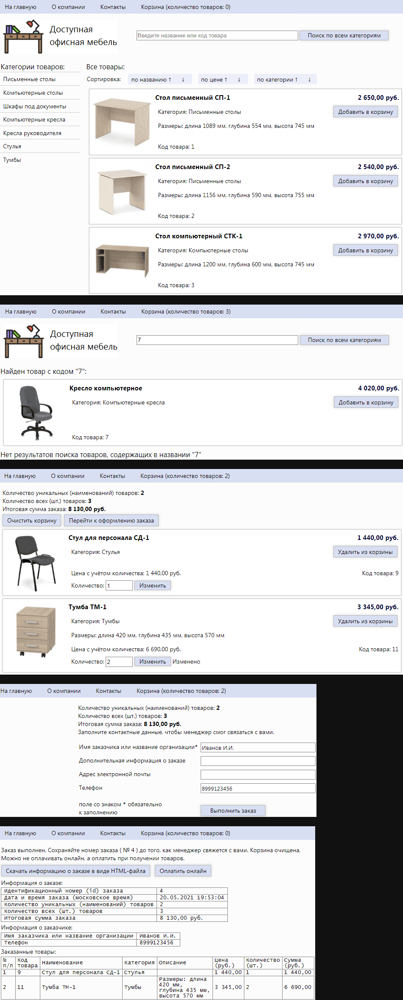
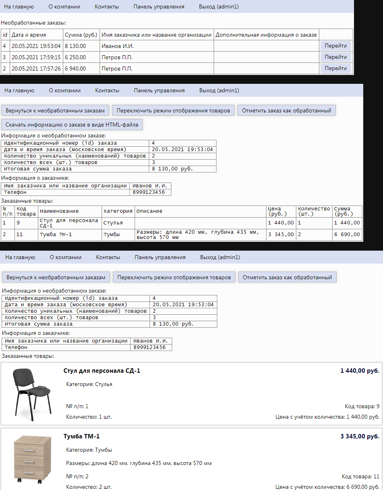
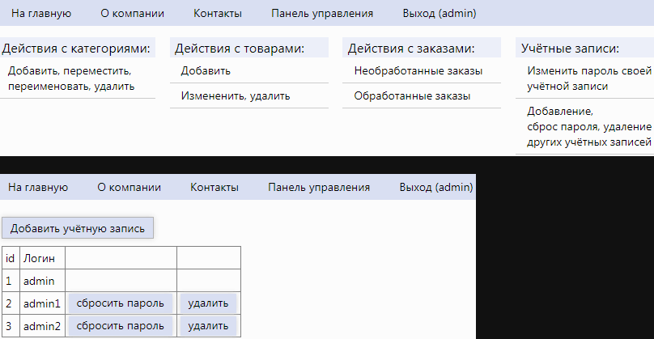

# Содержание

- [Тип репозитория](#Тип-репозитория)
- [Информация о проекте](#Информация-о-проекте)
  - [Основная информация](#Основная-информация)
  - [Периоды работы над проектом](#Периоды-работы-над-проектом)
  - [Применённые технологии](#Применённые-технологии)
- [Скриншоты](#Скриншоты)
  - [Администратор (добавление и изменение товара)](#Администратор-добавление-и-изменение-товара)
  - [Покупатель (совершение заказа)](#Покупатель-совершение-заказа)
  - [Администратор (обработка заказа)](#Администратор-обработка-заказа)
  - [Главный администратор (управление учётными записями администраторов)](#Главный-администратор-управление-учётными-записями-администраторов)

---

# Тип репозитория

[⬆](#Содержание)

Это не проект с открытым исходным кодом. Это портфолио в виде информации о проекте (со скриншотами результата работы над проектом).

---

# Информация о проекте

## Основная информация

[⬆](#Содержание)

Это интернет-магазин, который я делал для своей университетской дипломной работы.

- Изначально я делал этот интернет-магазин для своей колледжной дипломной работы.
- Потом я усовершенствовал этот интернет-магазин и использовал его для своей университетской дипломной работы.

По сравнению с колледжной дипломной работой, в университетской дипломной работе я добавил много новых функций и возможностей.

---

## Периоды работы над проектом

[⬆](#Содержание)

- Во время учёбы в колледже:
  - после сессии и до защиты диплома (примерно 15.04.2017 — 15.06.2017).
- Во время учёбы в университете:
  - после сессии и до защиты диплома (примерно 15.04.2021 — 15.06.2021).

---

## Применённые технологии

[⬆](#Содержание)

- FrontEnd
  - HTML (своя вёрстка)
  - CSS (свои стили)
  - JavaScript (без фреймворков)
    - библиотека "JQuery" для фоновых AJAX-запросов на BackEnd
    - библиотека "SimpleBox" для просмотра изображений в модальном окне
- BackEnd
  - php (без фреймворков)
  - база данных
    - СУБД "MySQL"
    - web-приложение "phpMyAdmin" для администрирования СУБД "MySQL"

Рендеринг HTML-страницы происходит на стороне сервера (BackEnd) в php.

---

# Скриншоты

## Администратор (добавление и изменение товара)

[⬆](#Содержание)

---

## Покупатель (совершение заказа)

[⬆](#Содержание)

---

## Администратор (обработка заказа)

[⬆](#Содержание)

---

## Главный администратор (управление учётными записями администраторов)

[⬆](#Содержание)

---

[⬆](#Содержание)